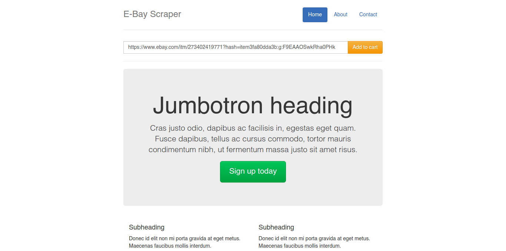
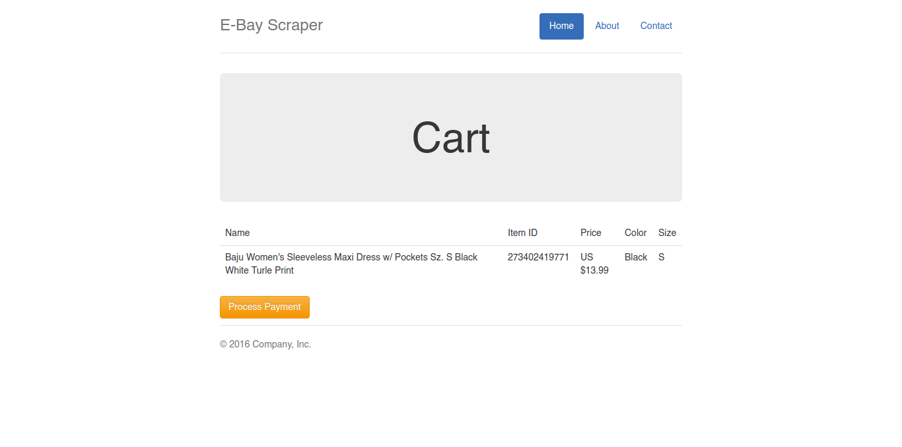
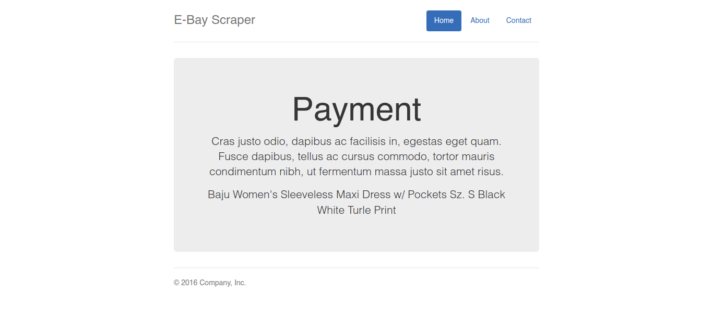

ebayscrapper :raised_hands:
===========================

Simply ebay scrapper app on Django.








### Instalation

I assume you already setup your django development with virtual enviroment (virtualenv).

**1. Create virtual enviroment and activate it.**

```
$ virtualenv --python=/usr/bin/python3 yourenv
$ source bin/activate
```

**2. Cloning this project**

```
$ git clone git@github.com:agusmakmun/ebayscrapper.git
```

**3. Install all requirements**

```
$ pip install -r requirements.txt
```

**4. Database migrations**

```
$ ./manage.py makemigrations
$ ./manage.py migrate
```

**5. Run the server**

```
$ ./manage.py runserver
```
